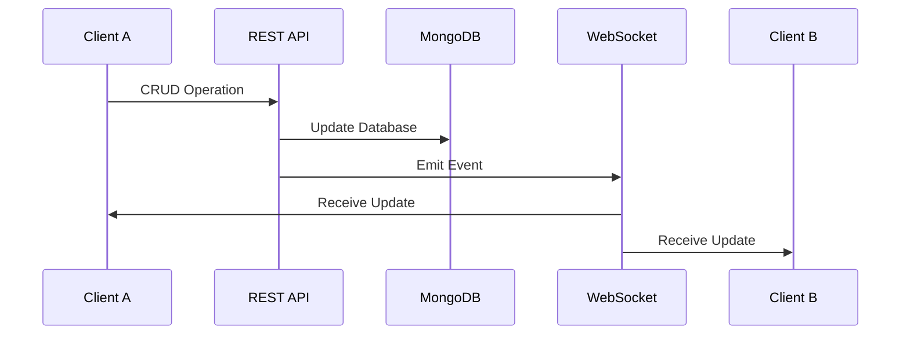

# RTSP Livestream Overlay Web Application

Assignment submission for **Livesitter – AI Full Stack Developer Internship**.

This application plays a livestream video and allows users to create, manage, and display real-time overlays (text or image) on top of the video. Overlay updates are synchronized live across all connected clients using WebSockets.

---

## 🚀 Tech Stack

### Frontend
| Technology | Purpose |
|------------|---------|
| React 19 | UI Framework |
| TypeScript | Type Safety |
| Vite | Build Tool & Dev Server |
| Socket.IO Client | Real-time Communication |
| hls.js | HLS Video Playback |

### Backend
| Technology | Purpose |
|------------|---------|
| Python | Runtime |
| Flask | Web Framework |
| Flask-SocketIO | WebSocket Integration |
| MongoDB (PyMongo) | Database |

---

## 🎥 RTSP Streaming Approach

Browsers do not natively support RTSP streams. To handle this, the application uses the standard industry approach:

```
RTSP → FFmpeg → HLS (.m3u8) → Browser Video Player
```

For demonstration purposes, a public HLS stream is used. The same UI seamlessly works with any RTSP stream converted to HLS.

---

## ✨ Features

| Feature | Description |
|---------|-------------|
| 📺 Livestream Playback | HLS video streaming with hls.js |
| 📝 Text Overlays | Add customizable text overlays |
| 🖼️ Image Overlays | Add image overlays on video |
| 🖱️ Drag-and-Drop | Position overlays by dragging |
| 📐 Resizable Overlays | Resize overlays as needed |
| ⚡ Real-time Updates | Instant sync via WebSockets |
| 💾 Persistent Storage | Overlays stored in MongoDB |
| 🔄 Full CRUD APIs | Create, Read, Update, Delete operations |

---

## 📡 Real-Time Architecture



**Flow:**
1. Client performs CRUD via REST APIs
2. Backend updates MongoDB
3. Backend emits WebSocket events
4. All connected clients receive updates instantly

---

## 📁 Project Structure

```
livesitter-rtsp-overlay-app/
├── backend/
│   ├── app.py              # Flask server + Socket.IO
│   ├── db.py               # MongoDB connection
│   ├── requirements.txt    # Python dependencies
│   └── .env                # Environment variables
│
├── frontend/
│   ├── src/
│   │   ├── components/
│   │   │   ├── VideoPlayer.tsx    # HLS video player
│   │   │   └── OverlayLayer.tsx   # Overlay management
│   │   ├── App.tsx                # Main application
│   │   ├── socket.ts              # Socket.IO client
│   │   └── main.tsx               # Entry point
│   ├── package.json
│   └── vite.config.ts
│
└── README.md
```

---

## 🔧 Running Locally

### Prerequisites
- Python 3.8+
- Node.js 18+
- MongoDB (local or cloud)

### Backend Setup

```bash
cd backend
python -m venv venv
venv\Scripts\Activate      # Windows
# source venv/bin/activate  # macOS/Linux
pip install -r requirements.txt
python app.py
```

Create a `.env` file in the `backend` folder:
```env
MONGODB_URI=your_mongodb_connection_string
```

✅ Backend runs at: `http://127.0.0.1:5000`

### Frontend Setup

```bash
cd frontend
npm install
npm run dev
```

✅ Frontend runs at: `http://localhost:5173`

---

## 📑 API Endpoints

| Method | Endpoint | Description |
|--------|----------|-------------|
| `GET` | `/health` | Health check |
| `GET` | `/api/overlays` | Fetch all overlays |
| `POST` | `/api/overlays` | Create new overlay |
| `PUT` | `/api/overlays/:id` | Update overlay by ID |
| `DELETE` | `/api/overlays/:id` | Delete overlay by ID |

### Overlay Schema

```json
{
  "_id": "string",
  "type": "text | image",
  "content": "string",
  "position": { "x": 0, "y": 0 },
  "size": { "width": 100, "height": 50 }
}
```

---

## 🔌 WebSocket Events

| Event | Direction | Payload |
|-------|-----------|---------|
| `overlay_created` | Server → Client | Overlay object |
| `overlay_updated` | Server → Client | Updated overlay |
| `overlay_deleted` | Server → Client | `{ "_id": "..." }` |

---

## 🎬 Demo Video

A short demo video is included demonstrating:

- ✅ Application startup
- ✅ Livestream playback
- ✅ Creating text and image overlays
- ✅ Dragging and repositioning overlays
- ✅ Resizing overlays
- ✅ Real-time synchronization across multiple clients
- ✅ Persistent storage verification

---

## 📬 Submission

**GitHub Repository:** [Jagadeesh9110/livesitter-rtsp-overlay-app](https://github.com/Jagadeesh9110/livesitter-rtsp-overlay-app)

---

## 👤 Author

**Jagadeeswar**  
AI Full Stack Developer Internship Candidate  
Livesitter Assignment Submission

---

